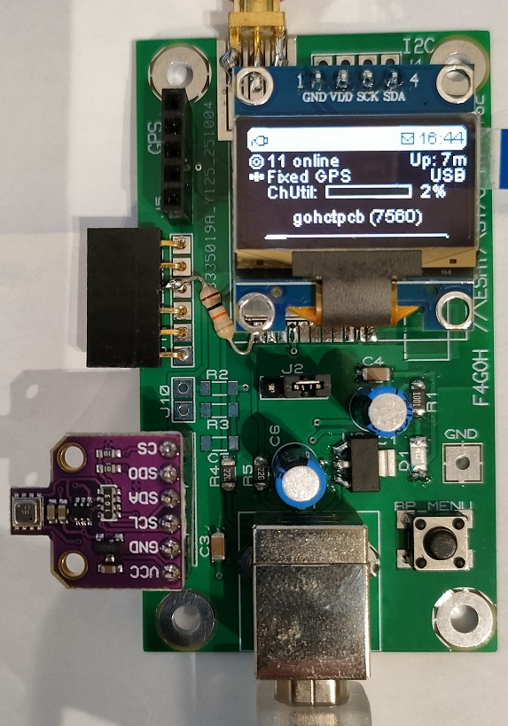
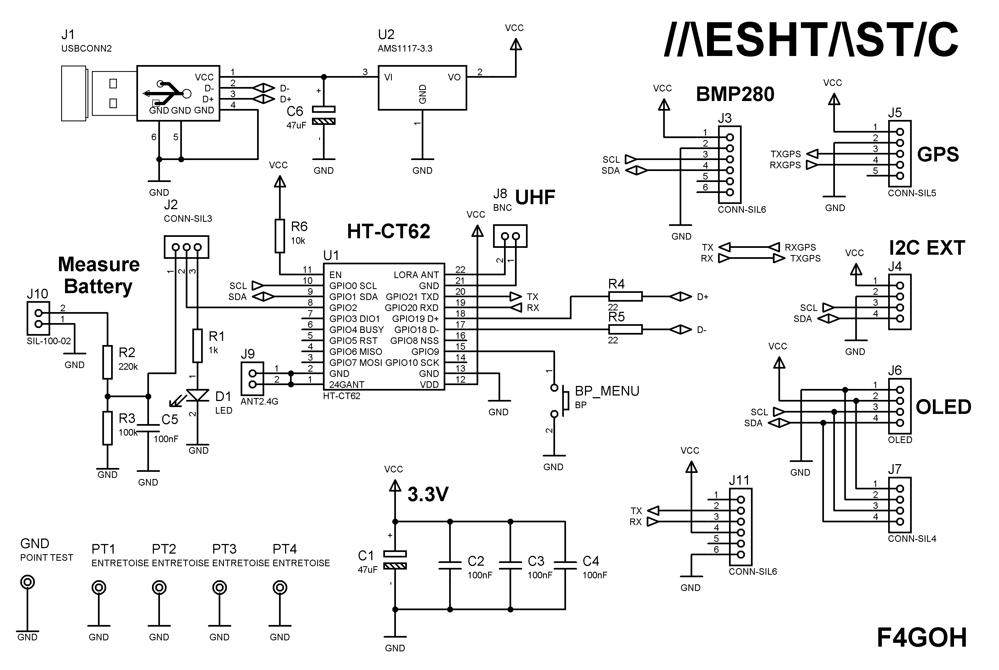
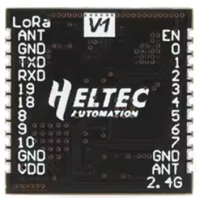
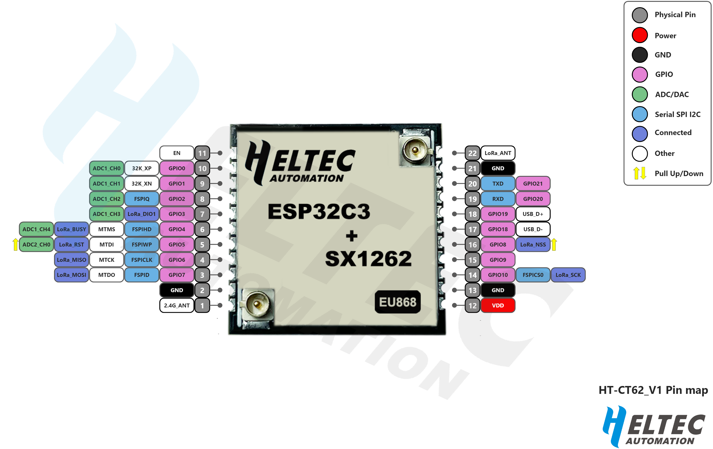
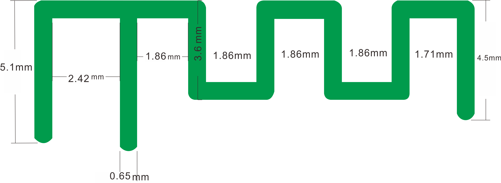
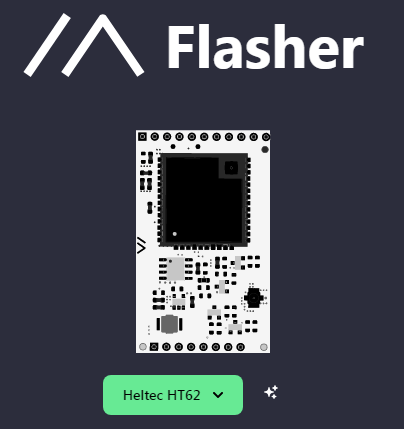
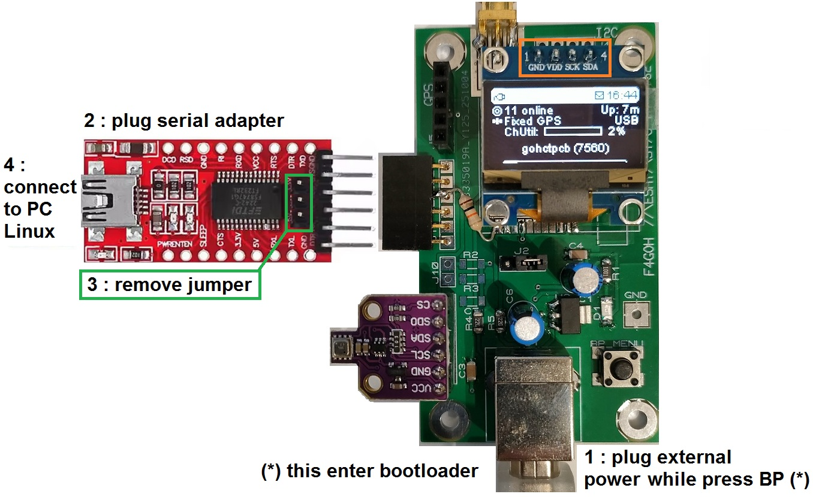

# CheapMesh
Meshtastic with HT-CT62 module



#  FROM Paul Hausk - this version by F4GOH
https://gitlab.com/paulhausk/CheapMesh

CheapMesh is a pcb arround the HT-CT62 chip by Heltec.

The goal is to get a cheap Meshtastic node with this chip, therefore some corners where cut.

## Schematic




## PCB


## BOM

| Reference     | Value         | Footprint / Description                          | Qty |
|---------------|---------------|--------------------------------------------------|-----|
| R1            | 1k            | Resistor_1206                                    | 1   |
| R2            | 220k          | Resistor_1206                                    | 1   |
| R3            | 100k          | Resistor_1206                                    | 1   |
| R4,R5         | 22            | Resistor_1206                                    | 2   |
| R6            | 10k           | Resistor_1206                                    | 1   |
| C1,C6         | 47uF          | Capacitor_vertical                               | 2   |
| C2,C3,C4,C5   | 100nF         | Capacitor_1206                                   | 4   |
| U1            | HT-CT62       | Integrated Circuit                               | 1   |
| U2            | AMS1117-3.3   | Integrated Circuit                               | 1   |
| D1            | LED           | Diode_1206                                       | 1   |
| BP_MENU       | BP            | Miscellaneous                                    | 1   |
| GND           | POINT TEST    | Miscellaneous                                    | 1   |
| J1            | USBCONN2      | Type B female connector                          | 1   |
| J2            | CONN-SIL3     | Male and strap connector                         | 1   |
| J3,J11        | CONN-SIL6     | Female connector                                 | 2   |
| J4            | —             | As you want                                      | 1   |
| J5            | CONN-SIL5     | Female connector                                 | 1   |
| J6            | OLED          | SSD1306 (GND VDD SCL SDA)                        | 1   |
| J7            | CONN-SIL4     | As you want                                      | 1   |
| J8            | SMA           | Female connector                                 | 1   |
| J9            | ANT2.4G       | On board antenna                                 | 1   |
| J10           | SIL-100-02    | Miscellaneous                                    | 1   |
| PT1-PT4       | ENTRETOISE    | Spacer                                           | 4   |


### Antenna 
* Option A: use the onboard antennas
* Option B: use an external antenna with the IPEX connector (and cutting of the onboard lora antenna)
* Option C: use an external antenna with an sma connector (and cutting of the onboard lora antenna)
* Option D: solder on a dipol antenna (and cutting of the onboard lora antenna)
  
### Powering the Board
Never connect more than one powersource at a time!!!
* Only via the usb type B
* Via the 3.3V with Serial module current is too low !!! remove jumper !!!
  

## Building instructions
WIP
1. Source the the pcb yourself. I recomend JLCPCB to get the pcb created. 5 pcbs should cost 2$ plus shipping and taxes.
2. Solder on the components.

## Pinout





## 2.4G Antenna size




## [Flasher](https://flasher.meshtastic.org/)






## Compile with OLED feature

[How to compile ?](https://www.youtube.com/watch?v=CTNXBvOog2I)
or read complilation_meshtastic_rpi.pdf in firmware directory to install platform.io

change variant.h in  meshtastic : firmware/variants/esp32c3/heltec_esp32c3/variant.h

```console
pio run -e heltec-ht62-esp32c3-sx1262
```

Or if platform.io is installed in your PC

```console
pio run -e heltec-ht62-esp32c3-sx1262 -t upload
```

## Flash the firmware with OLED feature

Install esptool

```console
pip install esptool
```

Update the firmware

```console
esptool.py --chip esp32c3 --port /dev/ttyUSB0 --baud 115200 write_flash --flash_mode dio --flash_size=4MB  0x10000 firmware.bin
```


 ## License
 <p xmlns:cc="http://creativecommons.org/ns#" xmlns:dct="http://purl.org/dc/terms/"><span property="dct:title">CheapMesh</span> by <span property="cc:attributionName">PaulHausK</span> is licensed under <a href="https://creativecommons.org/licenses/by-sa/4.0/?ref=chooser-v1" target="_blank" rel="license noopener noreferrer" style="display:inline-block;">Creative Commons Attribution-ShareAlike 4.0 International</a></p>